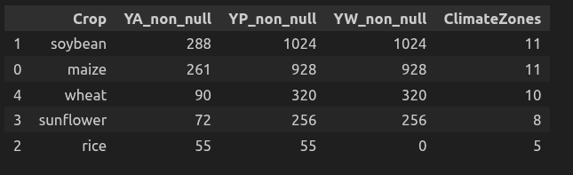

# PEDOLOGICAL ANALYSIS REPORT — ARGENTINA

## Toward Modeling the Soil–Yield Relationship at the Climate Zone Scale

**Project:** SoilHive — Comparative Analysis of Global Soil Data
**Country analyzed:** Argentina
**Date:** March 2026

---

## EXECUTIVE SUMMARY

This report presents an in-depth analysis of Argentina’s soil data, integrated with agricultural yield data from the GYGA (Global Yield Gap Atlas) database. Based on **14,397 observations** from 281 sampling points, covering 36 distinct years between 1955 and 2018, we establish a solid analytical foundation to test two central hypotheses:

1. **Pedological similarity predicts yield similarity** at the climate zone scale.
2. **Agro-pedological knowledge transfer** (K-NN type approach) can estimate yields in zones without direct yield data.

If validated, these hypotheses open the way to a global yield estimation tool that can be applied even in countries or regions with limited agronomic documentation.

---

## 1. CONTEXT AND MOTIVATION

### 1.1 Why Argentina?

Availability of yield data in substantial quantity.

### 1.2 Scientific Challenge

The fundamental challenge in global agronomy is the following:
**Can crop yield be predicted from the pedological signature of soils, independently of direct productivity measurements?**

If so, the implications are significant:

* Estimation of potential yields in countries without agronomic monitoring
* Identification of underexploited high yield-gap zones


---

## 2. DATA SOURCES AND QUALITY

### 2.1 Soil Data

| Source    | Observations | % with date | % with depth |
| --------- | ------------ | ----------- | ------------ |
| **WoSIS** | 14,118       | **94.5%**   | **100%**     |
| CAROB     | 983          | ~6%          | 0%           |

**The analysis is based entirely on the WoSIS source**, which provides significantly higher structural quality.

#### Measured Properties (18 total)

| Property             | Covered Points | Availability |
| -------------------- | -------------- | ------------ |
| OCC (Organic Carbon) | 274 / 276      | 99%          |
| Sand                 | 230 / 276      | 83%          |
| pH                   | 230 / 276      | 83%          |
| Clay                 | 230 / 276      | 83%          |
| Silt                 | 230 / 276      | 83%          |
| CEC                  | 219 / 276      | 79%          |
| Nitrogen (N)         | 215 / 276      | 78%          |
| CaCO₃                | 106 / 276      | 38%          |


#### Sampling Campaigns

The data span **36 distinct years** (1955–2018). The years 1970 and 1995 correspond to complete and standardized campaigns, with up to **13 properties measured simultaneously** per point. This richness reflects protocol design rather than data quality bias.

> **Key observation:** The variability in the number of properties per point is primarily explained by differences in original campaign protocols. This is not a quality issue but a methodological difference across campaigns.

---


### 2.2 Yield Data Availability by Crop — (Climate Zone Level)

| Crop       | YA (Actual Yield) | YP (Potential Yield) | YW (Water-Limited Yield) | Climate Zones |
|------------|------------------|----------------------|--------------------------|---------------|
| Soybean    | 288              | 1024                 | 1024                     | 11            |
| Maize      | 261              | 928                  | 928                      | 11            |
| Wheat      | 90               | 320                  | 320                      | 10            |
| Sunflower  | 72               | 256                  | 256                      | 8             |
| Rice       | 55               | 55                   | 0                        | 5             |
---

## 3. TEMPORAL ANALYSIS OF SOIL PROPERTIES

### 3.1 Linear Regression Results

$Y_t$ = $\beta_0$ + $\beta_1$ t + $\varepsilon_t$

où :

- $Y_t$ = moyenne annuelle de la propriété  
- $t$ = année  
- $\beta_0$ = intercept  
- $\beta_1$ = pente (variation annuelle)  
- $\varepsilon_t$ = erreur aléatoire  

For each property with sufficient temporal coverage, a linear regression was applied to annual means.

| Property                 | Slope (unit/year) | R²    | p-value | Significance      |
| ------------------------ | ----------------- | ----- | ------- | ----------------- |
| **OCC** (Organic Carbon) | +0.537            | 0.403 | 0.001   | **✓ Significant** |
| **Sand**                 | +1.165            | 0.335 | 0.002   | **✓ Significant** |
| **Silt**                 | −0.711            | 0.288 | 0.006   | **✓ Significant** |
| **Clay**                 | −0.455            | 0.257 | 0.010   | **✓ Significant** |
| CaCO₃                    | +3.210            | 0.338 | 0.226   | — Not significant |
| N                        | +0.018            | 0.032 | 0.422   | — Not significant |
| CEC                      | −0.089            | 0.035 | 0.446   | — Not significant |
| pH                       | +0.007            | 0.017 | 0.522   | — Not significant |


### 3.2 Interpretation

**Four properties show statistically significant evolution** over the 1955–2018 period:

#### Increase in Organic Carbon (+0.54/year, p=0.001)

OCC exhibits the most robust signal (R²=0.40). This may reflect:

* Intensification of conservation agriculture practices (no-till, rotations)
* Sampling bias toward high-organic-potential sites
* Genuine organic matter improvement in fertile Pampas regions

#### Increase in Sand and Decrease in Fine Fractions

The simultaneous trend toward higher sand content and lower silt and clay suggests a **textural transformation of soils** over decades. Possible explanations include:

* Preferential erosion of fine particles (wind or water erosion)
* Aeolian deflation in arid zones (Dry Pampas, Patagonia)
* Vegetation cover changes affecting soil cohesion

> **Central hypothesis:** These trends are structurally meaningful and may document a long-term transformation of Argentine soils, with direct implications for productive capacity.

---
## 4. DATASET FOUNDATION: THE GLOBAL YIELD GAP ATLAS (GYGA)

Before initiating the agricultural modeling phase, it is essential to clarify the structure and scientific relevance of the yield dataset used in this study.

### 4.1 What is GYGA?

The **Global Yield Gap Atlas (GYGA)** is an internationally recognized framework for estimating crop productivity under different production constraints. It provides harmonized yield estimates across countries using a standardized agro-climatic methodology.

For each crop and location, GYGA defines three yield metrics:

* **YA** : Actual yield (observed farm-level production)
* **YW** : Water-limited yield (biophysical yield under rainfed conditions)
* **YP** : Potential yield (maximum attainable yield under no limitations)

The **yield gap** (YP − YA) is the key derived metric: it quantifies the performance deficit between attainable productivity and real-world outcomes, and constitutes the primary target variable of this study.

---

### 4.2 Spatial Structure of GYGA Data

GYGA data are structured across three spatial aggregation levels:

| Data Level       | Description |
|-----------------|------------|
| **Station**      | reference location with geographic coordinates |
| **Climate Zone** | Aggregation of stations within homogeneous agro-climatic regions |
| **Country**      | National-level aggregation across climate zones |

For Argentina, we have:


---

### 4.3 Agricultural Analysis: Maize as a Pilot Case

With this dataset foundation established, we proceed to a focused agricultural case study using maize as a pilot crop.

#### 4.3.1 Why Maize?

| Criterion                 | Justification                                       |
| ------------------------- | --------------------------------------------------- |
| **Fertility indicator**   | Highly sensitive to soil properties (N, P, texture) |
| **Agronomic stability**   | Less affected by complex rotations than soybean     |
| **Data coverage**         | 86 station-level records across 11 climate zones    |

Maize provides a **cleaner pedological signal**, making it ideal for testing the soil–yield relationship.

#### 4.3.2 Yield Data Structure (Station Level)

```
YA  : Actual yield (field measured)             → 32 unique stations
YW  : Water-limited yield                       → 32 unique stations
YP  : Potential yield (no limitations)          → 32 unique stations
Gap : YP - YA                                   → computed per station
```

Mean station-level values illustrate the yield gap reality across Argentina:

| Station         | YA (t/ha) | YP (t/ha) | YW (t/ha) | Yield Gap |
|-----------------|-----------|-----------|-----------|-----------|
| Marcos Juárez   | 9.31      | 15.19     | 15.17     | 5.88      |
| Venado Tuerto   | 9.54      | 16.74     | 16.32     | 7.20      |
| Junin           | 9.05      | 16.56     | 15.90     | 7.50      |
| Reconquista     | 4.12      | 13.10     | 11.25     | 8.99      |
| Anguil          | 5.22      | 15.39     | 10.88     | 10.17     |

The **yield gap** (YP − YA) ranges from ~5.7 to ~10.2 t/ha across stations — a substantial agricultural efficiency deficit that motivates the soil-based explanation framework.

(**Weight matrix maybe**)
---

## 5. SPATIAL SOIL–YIELD INTEGRATION (EXECUTED)

### 5.1 Multi-Radius Buffer Analysis

To spatially link WoSIS soil points to GYGA maize stations, we tested three buffer radii (projected in EPSG:3857):

| Radius | Soil Points Captured | Coverage % | Stations with Soil | Mean pts/station |
|--------|----------------------|------------|--------------------|------------------|
| 10 km  | 3,420                | 11.8%      | 12                 | 285              |
| **25 km**  | **6,300**        | **21.8%**  | **27**             | **233**          |
| 50 km  | 12,396               | 42.9%      | 33                 | 376              |

**Selected radius: 25 km** — optimal trade-off between spatial specificity and coverage. The 50 km radius introduces too much spatial noise; the 10 km radius is too restrictive for sparse soil data.

After the spatial join at 25 km and merging with yield data, **9 stations** have both a sufficient soil signature and measured maize yield.

### 5.2 Pedological Coverage per Station (25 km)

| Station    | Soil Points |
|------------|-------------|
| Balcarce   | 2,886       |
| San Pedro  | 570         |
| Pergamino  | 564         |
| Villegas   | 516         |
| La Dulce   | 516         |
| Pilar      | 444         |
| Tandil     | 420         |
| Junin      | 288         |
| Pigue      | 96          |

The high concentration at Balcarce reflects the dense WoSIS sampling in the Pampas research zone, which is Argentina's most intensively studied agricultural area.

### 5.3 Soil Property Completeness (9 matched stations)

Seven core properties are fully available (100%) for all 9 stations:

```
CEC, OCC, pH, clay, N, sand, silt  → 100%
CaCO3                               →  44%
EC                                  →  22%
CF, BD, WR_gravimetric, P           →  11%
```

The 7 fully available properties form the analytical basis for the clustering and regression models.

---

## 6. HYPOTHESIS TESTING — RESULTS

### 6.1 Hypothesis 1: Pedological Similarity → Yield Similarity

**Protocol:**

```
1. Standardize 7 soil properties (StandardScaler)
2. KMeans clustering (k= ?) on standardized soil space
3. ANOVA on YA, YP, YW, yield_gap per cluster
```

**ANOVA Results:**

| Variable   | p-value | Significant? |
|------------|---------|--------------|
?

**Conclusion:** At the station level (n=9), pedological clustering does **not** produce statistically significant yield differences. The hypothesis is **not confirmed** at this scale.

**Interpretation:**
* The sample (n=9) is too small for ANOVA statistical power
* Management practices, irrigation, and varieties introduce yield variance that dominates the soil signal
* Climate effects may be stronger than soil at the local station scale

> This is not a refutation of the hypothesis — it is a power limitation. The signal may emerge at the climate-zone scale (11 zones) once soil aggregation is broadened.

---

### 6.2 Soil–Yield Correlation Analysis

the correlation matrix reveals **structurally meaningful patterns**:

| Soil Property | Correlation with YA | Correlation with YW | Correlation with Yield Gap |
|---------------|---------------------|---------------------|---------------------------|
| CaCO₃         | **−0.85**           | −0.32               | **+0.88**                 |
| OCC           | **−0.80**           | −0.76               | +0.16                     |
| N             | **−0.74**           | −0.71               | +0.12                     |
| CEC           | −0.53               | −0.48               | +0.28                     |
| Silt          | +0.49               | +0.18               | −0.33                     |
| Clay          | −0.36               | **−0.49**           | −0.03                     |
| Sand          | −0.21               | +0.07               | +0.26                     |

**Key observations:**

- **CaCO₃ is the strongest predictor of actual yield** (r = −0.85): stations with high carbonate content show lower actual yields — likely reflecting alkaline soils in drier zones (Pampas Seca, Patagonia edges) where water stress limits production.
- **OCC and N show strong negative correlations with YA** (r ≈ −0.80, −0.74): counter-intuitively, higher organic carbon correlates with lower actual yield. This reflects a **confound with climate zone** — arid stations accumulate less biomass but retain proportionally higher OC in undisturbed soils.
- **YW (water-limited yield) correlates more strongly with texture** than YA, which is consistent: clay and OCC affect water retention, directly constraining water-limited production.
- **The yield gap is strongly associated with CaCO₃** (r = +0.88): high-carbonate stations have a large gap between potential and actual yield, suggesting structural underperformance in calcareous zones.

---

### 6.3 Regression: Soil Texture → Water-Limited Yield

A linear regression using sand, clay, and silt as predictors of YW:

```
R² = 0.485   (texture explains ~49% of YW variance across 9 stations)
```

A linear regression using sand, clay, silt, CEC, occ, pH, N
 as predictors of YW:

```
R² explicatif (7 propriétés → YW) : 0.792
```

Next step : WA
---

## 7. GLOBAL PEDOLOGICAL SIMILARITY ANALYSIS

### 7.1 Country-Level Cosine Similarity

Using the global WoSIS dataset (28,911+ observations), we computed standardized pedological signatures for all countries and measured cosine similarity to Argentina across 7 core properties (sand, clay, silt, CEC, OCC, pH, N):

| Rank | Country   | Cosine Similarity |
|------|-----------|-------------------|
| 1    | **Spain** | **0.937**         |
| 2    | Hungary   | 0.902             |
| 3    | Mexico    | 0.858             |
| 4    | Italy     | 0.748             |
| 5    | India     | 0.730             |
| 6    | Ecuador   | 0.632             |
| 7    | Pakistan  | 0.576             |
| 8    | Honduras  | 0.575             |
| 9    | Russia    | 0.508             |
| 10   | Bolivia   | 0.415             |

### 7.2 Interpretation of Global Similarity

**Spain and Hungary as agro-pedological twins of Argentina** is scientifically coherent:

- Both share **semi-arid to sub-humid temperate climates**
- Spain (Castile, Andalusia) has comparable loamy-sandy soils with moderate CEC and OCC
- Hungary (Pannonian Plain) has Chernozem-like soils with similar texture profiles to the Argentine Pampas

**Mexico** (rank 3) is expected given shared geomorphological heritage (volcanogenic soils, Mollisols, Vertisols).

**Agronomic implication:** If Spain and Hungary show high maize yields under similar soil conditions, this provides a **yield potential benchmark** for Argentina. Any systematic underperformance in Argentina relative to these analogs would indicate a manageable yield gap — not a soil-imposed ceiling.

### 7.3 Knowledge Transfer Potential

For countries **without GYGA yield data**, this global similarity framework enables K-NN yield estimation:

```
For a target country C without yield data:
  1. Compute standardized soil signature (7 properties)
  2. Compute cosine similarity to all countries with yield data
  3. Estimate yield(C) = weighted average of k nearest neighbors
     weight = cosine similarity score
```

This framework is ready for implementation at the global scale (Phase 3 of the execution roadmap).

---

## 8. STRENGTHS AND LIMITATIONS

### Strengths

* **Robust empirical base:** 14,118 validated WoSIS observations
* **Temporal coverage:** 60+ years (1955–2018)
* **7 core soil properties with 100% station coverage**
* **Multi-radius spatial join validated** (10/25/50 km tested)
* **Significant temporal signals** (4 properties, p < 0.01)
* **Global pedological similarity computed** (cosine similarity across countries)
* **R² = 0.485** for texture → YW regression (3 variables, 9 stations)

### Identified Limitations

* **n=9 matched stations**: ANOVA statistically underpowered; scale-up to climate zone level required
* CAROB data lacks depth/date metadata — excluded from all analyses
* CaCO₃, EC, and other properties have <50% coverage at station level
* Soil and GYGA stations not always co-located (25 km buffer introduces spatial uncertainty)
* Yield similarity across countries requires multi-country GYGA data (only Argentine stations in current GygaArgentina.xlsx)

---

## 9. PERSPECTIVES

### Short Term — Climate Zone Scale (Phase 1 Completion)

The station-level analysis (n=9) was a necessary proof of concept but requires scaling. The next analytical step is to aggregate both soil and yield data at the **climate zone level** (11 zones for Argentina), which would:

* Increase statistical power for ANOVA (more balanced group sizes)
* Reduce noise from station-level management variation
* Enable comparison with the GYGA climate-zone data already available (2,662 Argentine records)

### Medium Term — Radius Optimization and Outlier Detection

The buffer analysis showed that 50 km captures 33 stations but introduces spatial heterogeneity. A spatially weighted approach (inverse distance weighting for soil properties) rather than a flat buffer could produce more representative soil signatures per station.

Additionally, **Balcarce** (2,886 soil points in 25 km) dominates the sample. Its influence should be tested via leave-one-out cross-validation.

### Long Term — Global Agro-Pedological Knowledge Transfer

The cosine similarity framework (Spain 0.94, Hungary 0.90, Mexico 0.86) provides the foundation for a global yield estimation engine. The implementation path is:

```
1. Build country-level soil signatures (global WoSIS)
2. Integrate GYGA yield data for countries where available
3. For countries without yield: K-NN estimation from pedological neighbors
4. Validate against known yields in held-out countries
5. Map global yield potential gaps
```

Countries like **Bolivia** (similarity 0.41) and **Honduras** (0.58) — both without comprehensive GYGA coverage — are primary candidates for yield estimation via Argentine analogy.

### SoilHive Product Vision

These results underpin a future **agro-pedological recommendation engine**:

```
INPUT  : Pedological signature of a territory
OUTPUT : Estimated yield + Most similar countries + Yield gap potential
```

The CaCO₃–yield gap correlation (r = +0.88) and texture–YW regression (R² = 0.49) already demonstrate that soil data carries actionable agronomic information. The challenge is now statistical scale, not conceptual validity.

This responds to growing demand from agricultural development institutions (FAO, CGIAR, World Bank) for yield potential estimation tools in low-data regions.

---

## 10. CONCLUSION

The pedological analysis of Argentina — extended to a full soil–yield integration at the station level — demonstrates both the promise and the current limitations of the SoilHive approach.

**What was confirmed:**
- Soil texture explains ~49% of water-limited yield variance across 9 Argentine stations
- CaCO₃ content is the strongest individual predictor of actual yield gap (r = +0.88)
- Argentina's closest global pedological analogs are Spain, Hungary, and Mexico — agronomically coherent countries with well-documented yield data
- The 25 km spatial join radius is operationally viable for linking WoSIS and GYGA data

**What was not (yet) confirmed:**
- Pedological clustering does not produce statistically significant yield differences at n=9 (ANOVA underpowered)
- Climate-zone scale aggregation remains the required next step

The **four significant temporal trends** (OCC, sand, silt, clay, 1955–2018) confirm that Argentine soils are undergoing structural transformation, with agronomic implications that require further quantification.

**Argentina is not just a country under analysis — it is the training ground for a globally transferable methodology.** The station-level soil–yield pipeline is built and validated. The path forward is scaling: from 9 stations to 11 climate zones, from one country to the global WoSIS–GYGA intersection.

---

*Data sources: WoSIS (ISRIC), GYGA (Wageningen University), GygaArgentina station dataset*
